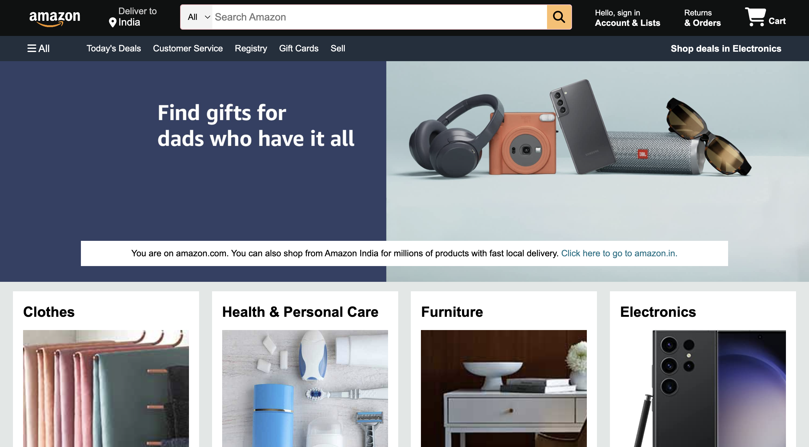
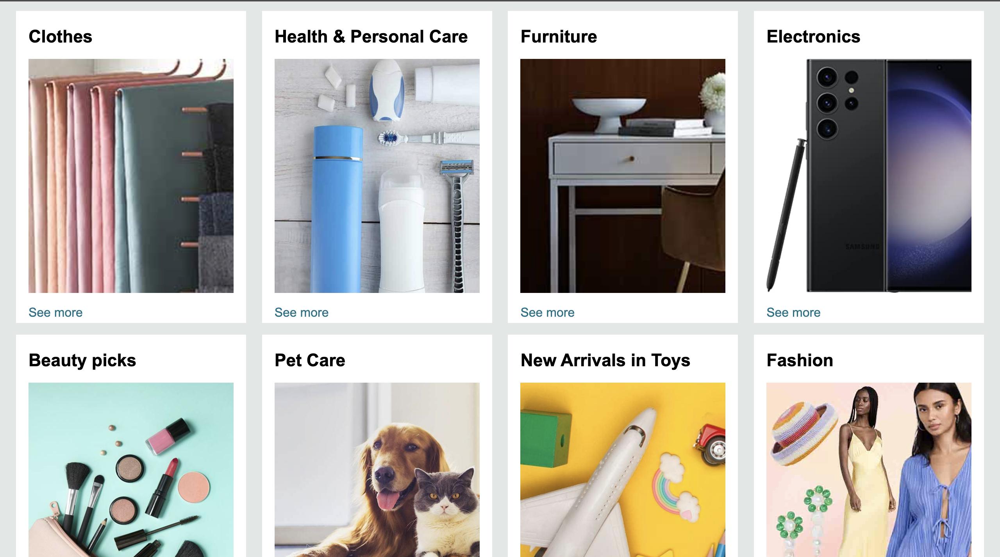
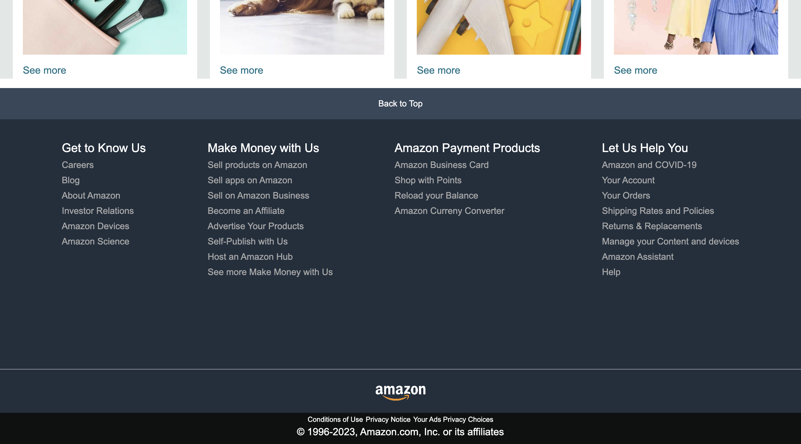

# 🛍️ Amazon Frontend Clone (UI Only)

This project is a **frontend-only clone of Amazon's homepage**, built using **HTML and CSS**. It replicates the look and feel of the Amazon website, including header, hero section, product grid, and footer — all with static content and responsive design.

> 🚫 Note: This project **does not include any backend functionality, React components, or interactivity**. It's a UI practice project hosted in a React project structure.

---

## ✨ Features

- 🖥️ Amazon-inspired layout and sections
- 🎨 Clean, responsive design using only HTML and CSS
- 📦 Product grid, search bar, navigation bar, and footer
- 📱 Fully responsive and mobile-friendly layout
- 🎯 Great for HTML/CSS practice and understanding layout structure

---

## 🛠 Technologies Used

- **HTML5** – Markup structure
- **CSS3** – Styling and responsiveness

---

## 🚀 Getting Started

1. Clone the repository:
```bash
git clone https://github.com/paveshkanungo/Amazon-Frontend-Resume-Project.git
cd amazon-frontend-clone
```

2. Then Run from the browser or Go Live from VS Code

---

## 🌟 Screenshots

> 
> 
> 

---

